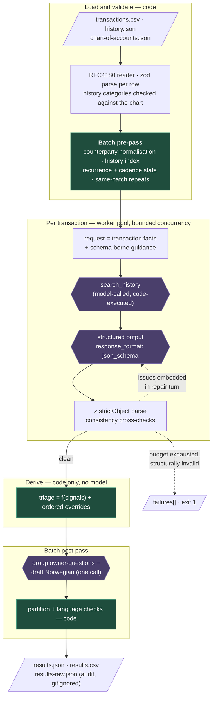

# Design

Classifies ~55 Norwegian bank transactions against a 22-account chart, decides per transaction
whether it can be posted without review (`auto-approve`), needs an accountant's eye
(`accountant-review`), or requires asking the business owner (`owner-question`), and drafts grouped
Norwegian questions for that last set. Runs against any OpenAI-compatible endpoint; the working
target is a 9B model on LM Studio.

This is a build spec, written before the system exists. Where the sibling design
(`../ticket-classification/DESIGN.md`) cites measured runs, this one states intent; the numbers get
filled in once real runs exist. One tension is owned up front: the brief caps the exercise at ~3
hours and grades overbuilding *down*, so this document is as explicit about what it drops from the
sibling architecture as about what it keeps.

## The organising idea

Three, of which the first two are inherited:

1. **The zod schema is the prompt.** Accounting guidance lives in `.describe()` on the field it
   governs; `z.toJSONSchema()` carries it into `response_format`. There is no separately maintained
   prompt string holding the rules, so the contract and the guidance cannot drift.
2. **Model-decided vs code-decided is a hard line.** The model reports observations — what the
   history shows, how clear the purpose is, whether it smells personal. Code owns every decision:
   the triage label, every threshold, every consequence of a rule.
3. **History is reached through a tool, not stuffed into the prompt.** The brief requires at least
   one meaningful tool call; this is where it is spent, and the data makes it load-bearing rather
   than decorative (see below).

## Data flow



Green is code-only; purple is where the model is consulted. Every decision sits downstream of the
purple nodes, never inside them.

## The tool call, and why it is load-bearing

`search_history({ counterparty, description_keyword?, limit })` returns normalised matches with a
category distribution, amount range, first/last seen, cadence in days — and an explicit *"no prior
transactions"* when empty. Arguments are model-authored and therefore the least trustworthy input in
the system: they get their own `z.strictObject` parse, with `limit` bounded to 1–50.

The test for a *meaningful* tool call is whether the answer changes when the tool returns something
unexpected. History passes that test on this data, measurably:

- **23 of 55** transactions have a counterparty appearing nowhere in the 150 history rows. A
  pre-injected exact-match blob answers nothing for the rows that actually need judgement.
- **`Skatteetaten` maps to three accounts** — `salary_tax` (6), `employer_tax` (6), `vat_payment`
  (6). The counterparty cannot resolve it; only the description can (`Forskuddstrekk` /
  `Arbeidsgiveravgift` / `MVA innbetaling`).
- **`KARI NORDMANN` is both `salary` and `owner_draw` inside this batch**, separated only by the
  description. Naive counterparty matching is a trap; the tool is how the model walks out of it.
- Six of 22 accounts (`transfer`, `owner_draw`, `loan_transfer`, `personal_expense`,
  `supplier_invoice`, `uncertain`) have **zero** history rows — "no prior" is the normal answer for
  exactly the accounts that need a human, so the tool says so loudly rather than returning the
  nearest thing.

**We own the loop.** The tool is declared with no `execute`; each `generateText` call runs a single
step, code executes the call and appends the result. A verdict returned with **zero** tool calls is
a repair issue, not an accepted answer — that is how "consult history first" becomes binding rather
than advisory. `MAX_TOOL_CALLS` (default 4) caps the phase.

**The small-model risk, and its fallback.** A 9B model may simply not emit a tool call. One repair
round demands it; if the second attempt also arrives without one, code performs the default lookup
itself, injects it as a tool result, marks the row `tool_call_missing`, and forces
accountant-review. The run degrades measurably instead of failing, and the report counts how often
this happened — the number that says whether the tool design survives this model.

**Measured, and the design changed because of it.** The first smoke against LM Studio
(qwen3.5-9b) produced **zero tool calls in the whole batch** — every row went through the injected
fallback and was floored at accountant-review. The cause was not the model's willingness but the
wire: `response_format` was attached from turn one, the server compiles that schema to a decoding
grammar, and a grammar that only admits the classification object makes a tool call literally
unemittable. The fix is protocol, not prompt: **the constraint is deferred until the tool phase is
over** — tool-phase turns go unconstrained (the schema still travels in the message for them), and
the answer turn is grammar-locked. Re-measured on the same smoke: 3 of 3 transactions called the
tool unprompted, 0 fallbacks, and the two recurring rows moved from accountant-review to their
correct auto-approve. `llm.test.ts` pins the contract — no `response_format` on a tool-phase
request, `strict: true` on the answer turn.

**What the tool deliberately is not.** Not a category-lookup: the 22 accounts total ~600 tokens and
are already the schema's enum with their guidance in `.describe()` — retrieval over something fully
present returns what the model can see anyway, and it would put a second copy of the category
knowledge on a different route, which is the drift the guidance-table pattern exists to prevent. Not
a reranking subagent: that moves the classification into a second call with strictly less context,
doubles cost, and adds an unaudited failure surface. One extension is held in reserve —
`lookup_accounts`, deterministic scoring over the *same* guidance table returning the top 3–5
candidates with their instructions, worth adding only if the eval shows a small model drowning in
the full guidance blob.

## Categories are a guidance table, not a list

Ported from `ticket-classification`'s `domain.ts` / `domain.schema.ts`, and the centre of this
design. One `as const satisfies readonly AccountEntry[]` array yields **both** the enum value the
model may emit **and** the `analysisInstruction` telling it when to emit that value. A category
cannot exist without its instruction; deleting one deletes the other; adding an account without an
instruction is a compile error.

```ts
{
  label: 'salary_tax',
  name: 'Salary withholding tax',
  description: 'Forskuddstrekk paid to Skatteetaten on behalf of employees.',
  analysisInstruction: prose`
    Skatteetaten is three different accounts and the counterparty cannot tell them apart — only
    the description can. Use this one when the description says Forskuddstrekk or skattetrekk.
    Arbeidsgiveravgift is employer_tax; MVA or merverdiavgift is vat_payment. If the description
    names none of the three, do not guess between them.
  `,
  sign: 'money_out', neverAutoApprove: false, alwaysAsk: false,
}
```

The last three fields are policy the model never sees — the sibling repo's `impairs` / `isBarrier`
trick. Description and instruction face outward as guidance; the flags stay behind as code-side
policy, in the same entry, so changing what may be auto-approved is an edit to one boolean rather
than to a prompt.

`chart-of-accounts.json` stays the shipped input, and the table is reconciled against it at startup:
`assertSameSet` between the table's labels and the file's codes, failing loudly at boot. That is the
repo's sanctioned escape hatch for a guidance table needing literal types (see
`.claude/skills/zod-first-types/SKILL.md`, "Data-driven enums") — duplication paid for with an
assertion.

The same pattern covers the signal enums, each a table of
`{ label, description, analysisInstruction, …policy }`:

| Table | Labels | Policy flag |
|---|---|---|
| `HISTORY_SUPPORT` | `EXACT_RECURRING`, `EXACT_ONE_OFF`, `SIMILAR_COUNTERPARTY`, `CATEGORY_PATTERN_ONLY`, `NONE` | `supportsAutoApprove` |
| `PURPOSE_CLARITY` | `UNAMBIGUOUS`, `INFERRED_FROM_PATTERN`, `AMBIGUOUS_BETWEEN_ACCOUNTS`, `UNKNOWABLE_FROM_BANK_DATA` | `blocksAutoApprove`, `asksOwner` |
| `PERSONAL_RISK` | `NONE`, `PLAUSIBLY_PERSONAL`, `LIKELY_PERSONAL` | `blocksAutoApprove` |
| `MISSING_INFORMATION` | `NONE`, `NEEDS_RECEIPT`, `NEEDS_PURPOSE`, `NEEDS_ATTENDEES`, `NEEDS_INVOICE`, `NEEDS_ACCOUNT_OWNERSHIP` | `asksOwner` |

The triage values themselves are **not** a table — they are fixed by the brief, so they are one
plain `z.enum(['auto-approve', 'accountant-review', 'owner-question'])`, written once and reused by
the pipeline, the eval and the tests.

## Model output — field order is load-bearing

Constrained decoding emits properties in schema order, so every field where the model *selects*
something is preceded by the field where it must state its reason. Ordered:

`history_evidence` → `history_support` → `reasoning` → `category_code` → `purpose_clarity` →
`personal_risk` → `missing_information` → `uncertainty_note` → `confidence`

The model is asked for **no triage label and no numbers**. Both are decisions, not observations, and
a decision generated inside the model can be neither audited nor tuned.

## Triage derivation — code, with the corners stated

```
auto-approve       history_support.supportsAutoApprove
                   and no signal sets blocksAutoApprove
                   and missing_information = NONE
                   and confidence = HIGH
                   and not account.neverAutoApprove
owner-question     any signal sets asksOwner, or account.alwaysAsk
accountant-review  otherwise
```

The decision reads the policy flags on the tables, so the automation policy is a column in a table,
not a chain of conditionals. Ordered overrides, each naming itself in `triage_reason`:

1. `account.alwaysAsk` (`uncertain`) ⇒ **owner-question** — the chart of accounts states this pairing literally
2. `account.neverAutoApprove` (`personal_expense`) ⇒ never auto-approve
3. cash withdrawal or P2P to a personal name (`MINIBANK …`, `VIPPS <person>`) ⇒ owner-question
4. `|amount| ≥ MATERIALITY_NOK` without `EXACT_RECURRING` support ⇒ at least accountant-review
5. `currency ≠ NOK` ⇒ at least accountant-review (t-00050 is EUR; the FX context needs checking)
6. `tool_call_missing` or an unresolved cross-check ⇒ at least accountant-review

`./run.sh --explain-triage` prints the decision table computed rather than quoted, with no endpoint
required. Why not ask the model: the automation rate becomes a dial rather than a prompt-wording
accident, the policy is testable offline, and every decision is auditable after the fact.

## Structured output enforcement

Every boundary is a zod parse, per the repo skill: the CSV (the only place `z.coerce` appears
besides env), the three JSON inputs, the LLM response *inside* the repair loop, tool-call arguments,
`process.env` at startup, and the output artifact before write. `z.strictObject` everywhere — a
plain `z.object` silently strips the invented key that is the evidence the contract was ignored.

Two SDKs appear in the manifest, each doing one job. The `ai` package (+
`@ai-sdk/openai-compatible`) is **transport**: it builds the HTTP call to whatever endpoint is
configured and normalises provider errors; its own structured-output machinery is unused. The
`openai` package is a **schema utility**: `zodResponseFormat` converts the zod schema — descriptions
included — into the strict `response_format` payload, replacing a hand-rolled JSON Schema walker.
The parts the brief actually grades — the tool loop, extraction, validation, cross-checks and the
repair loop — are owned in `llm.ts`, and neither SDK decides anything on their behalf.

**Malformed response** — reasoning traces stripped first, then JSON extracted from fenced or
embedded text, then re-ask. **Structural violation** — the zod issues rendered into a follow-up turn
beside the rejected output. **Valid-but-incorrect** — consistency cross-checks, the reason the
drivers are enums rather than prose:

- `EXACT_RECURRING` claimed where the index holds no prior for that counterparty
- category contradicting an unambiguous history majority (≥80% of ≥3 priors) with the reasoning not naming the conflict
- `history_evidence` citing a counterparty that appears in no tool result returned this conversation
- sign contradiction against `AccountEntry.sign` — `customer_payment` on money out, `salary` on money in
- `category = uncertain` paired with `confidence = HIGH`
- zero tool calls

**When a result cannot be produced** — two outcomes, deliberately different. Schema-valid but still
disputed after the budget: published, forced to accountant-review, carrying the contradiction — a
usable draft that conflicts with a computed fact is exactly what a reviewer exists to settle.
Structurally invalid after the budget: no result, recorded in `failures[]`, exit non-zero. Nothing
is invented either way.

## Question grouping and the Norwegian

Owner-question rows go to one model call that proposes the grouping and drafts one Norwegian
question per group. Code proposes candidate groups by normalised counterparty first, then validates
what comes back:

- **it is a partition** — every owner-question id appears exactly once, no invented ids. The failure
  mode is a *dropped* transaction, which reads as handled and is not.
- **the Norwegian** — ends in `?`, names the amount and the date or counterparty, no English
  stopwords, 40–400 characters.

Both feed the same repair loop. The grouping targets are visible in the data: three Vipps payments
to Lars Hansen, two ATM withdrawals, four grocery-type merchants (`REMA 1000`, `MENY`, `ICA NÆR`,
`SAMSON BAKERI`) — the last is why grouping cannot be a pure counterparty key, and why the model
proposes the partition while code checks it.

## Measurement

`./eval.sh` runs the real pipeline against `data/gold.json` — all 55 transactions hand-labelled
(the 10 provided labels kept verbatim) plus a handful of synthetic adversarial rows, every row
tagged `provided` / `added` and `contested` where the right answer is genuinely arguable.

**The headline is deliberately not accuracy**, because a wrong auto-approve and a wrong escalation
cost completely different things:

1. **Auto-approve precision** — of rows auto-approved, the share where gold agrees on category *and*
   triage. The number that decides whether the system can post without review.
2. **Dangerous misses** — every auto-approved row that gold says needed a human, listed
   individually, never collapsed to a rate.
3. **Triage 3×3 confusion matrix**, cells labelled by cost: silent error / wasted owner time /
   harmless caution.
4. **Automation rate** against the precision it buys — the trade, not one side of it.
5. **Category accuracy** overall, per account, and the confusion pairs that actually occur
   (`meals ↔ personal_expense`, `supplier_invoice ↔ professional_services`).
6. **Confidence calibration** — accuracy bucketed by self-reported confidence. If `HIGH` is not
   materially better than `MEDIUM`, the field is decoration and the report says so.
7. **Question quality** — partition validity, compression (groups vs transactions), the language
   checks, and every drafted question printed in full for a human to read.
8. **Tool health** — calls per transaction, `tool_call_missing` count, repair rounds.
9. **Cost and latency** — tokens in/out, $/run at a configured rate, p50/p95 per transaction.
10. **Determinism** — a repeat run, reporting category/triage agreement.

Every rate splits by gold source (`provided` 10 / `added` / synthetic), so hand-written labels
cannot flatter the system.

## Carried over from ticket-classification / deliberately dropped

**Carried:** the guidance-table→enum pattern with `analysisInstruction`; zod-first types with parse
at every boundary; the model/code line; the conversational repair loop, distinct from transport
retries in the worker pool; the batch pre-pass; consistency cross-checks; the gitignored raw audit
artifact; `--dry-run` and `--explain-*`; the Docker-first scripts and CI. Also `SCHEMA_IN_PROMPT`,
which it would have been a mistake to drop: local constrained decoders compile the schema to a
grammar and discard every `description` — and this design puts all of its accounting guidance in
`description`. Without the schema rendered into the message, the target model never sees any of it.

**Dropped, each with its reason:** the three-rung structured-output capability ladder (one endpoint
class here — the mode is pinned and noted in `LIMITATIONS.md`); per-type memoised schema variants
(no equipment-type analogue); the four separate eval suites (compressed into one report, which is
what the brief actually asks for); the 300-character trim machinery (no length contract in this
brief).

## Assumptions

- `amount_nok` is signed; negative is money out. An expense account on a positive amount is a
  contradiction, not a rounding quirk.
- t-00050 carries `currency: EUR` in an `amount_nok` column — treated as already converted and
  flagged for review, not reconverted.
- The batch is one run. No persistence, no memory of previously asked questions or owner answers.
- Owner-facing questions are Norwegian; all internal reasoning and output is English.
- The supplied material under `ai-engineer/` is kept byte-for-byte; everything this repo authors
  lives outside it.
